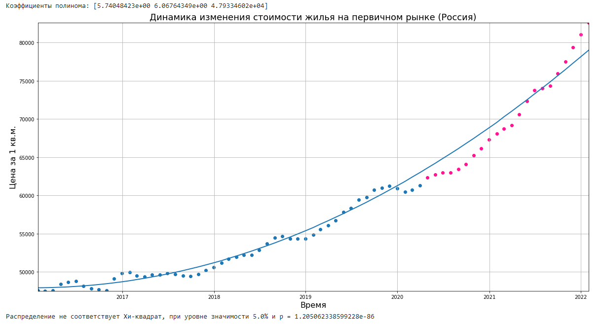

# Метод наименьших квадратов для прогнозирования значений временного ряда
> Реализация метода наименьших квадратов для прогнозирования значений временного ряда на языке Python. Также производится оценка адекватности полученной модели по критерию Хи-квадрат. Результатом выполнения кода является модель в виде полинома n-степени, график функции и сообщение о соответствии нулевой гипотезе.

> Чтобы скрипт правильно обработал данные необходимо вначале задать настроечные параметры:
- В переменной **polynomial_degree** задаётся степень полинома
- В переменной **path_file** задаётся путь к CSV-файлу
- В переменной **delim** указывается разделитель между первым и вторым столбцами
- В переменной **alpha** указывается альфа для критерия Хи-квадрат
- В переменных **x_title** и **y_title** указываются заголовки по осям X и Y соответственно
- В переменной **graphic_title** указывается заголовок графика

> Структура файла CSV должна быть приведена в соответствие со следующими принципами: 
 - В первом столбце должны быть значения даты в формате DD.MM.YYYY
 - Во втором столбце должны быть значения действительных чисел, которые будут располагаться по оси Y

> Результат выполнения с файлом *Data.csv*, расположенным в папке **Example** можно увидеть ниже:

